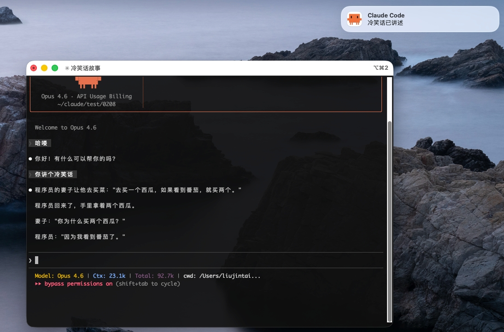
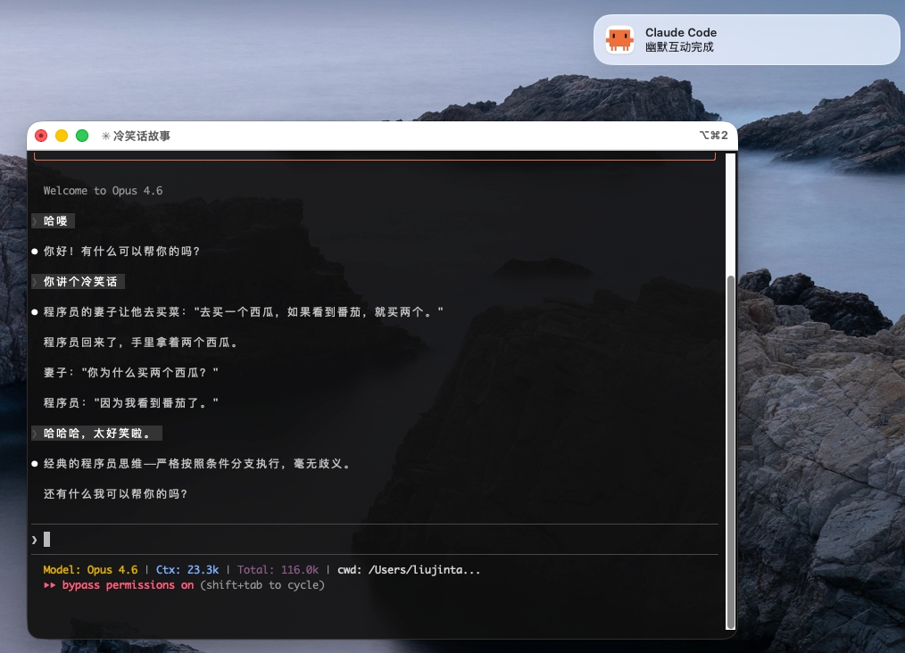

# CC Notify

Instant desktop notifications for Claude Code — get notified the moment AI completes its response.

> This project is based on [liujintai/claude-code-notify](https://github.com/liujintai/claude-code-notify), modified to remove dependency on Claude Haiku API and achieve pure local ultra-fast response mode.


## ✨ Features

- ⚡ **Lightning Fast**: <0.1s response time (millisecond-level)
- 🎨 **Custom Icon**: Claude-branded app icon
- 🚀 **Zero Dependencies**: No network calls, 100% reliable
- 💡 **Plug & Play**: No configuration required, works out of the box

## 📸 Preview

When Claude Code completes a task, you'll receive a notification:





## 💻 Requirements

- macOS (Apple Silicon and Intel supported)
- Python 3.8+
- Swift Compiler (Xcode Command Line Tools)
- Claude Code CLI

## 🚀 Installation

### Method 1: One-Click Install (Recommended)

```bash
curl -fsSL https://raw.githubusercontent.com/wanghuan9/cc-notify/main/install.sh | bash
```

### Method 2: Clone Repository

```bash
git clone https://github.com/wanghuan9/cc-notify.git
cd cc-notify
bash install.sh
```

## 📦 After Installation

1. Start a new Claude Code session
2. If you don't see the test notification, go to **System Settings → Notifications → ClaudeNotify** and enable notifications

## ⚙️ How It Works

```
Claude Code finishes response
       ↓
  Stop Hook triggered
       ↓
  notify.py executes
       ↓
  ClaudeNotify.app sends notification
       ↓
  Instant display (<0.1s)
```

1. Claude Code's Stop Hook triggers `notify.py` when each response completes
2. `notify.py` directly calls `ClaudeNotify.app` to send "Task Completed" notification
3. Sends macOS notification with Claude icon via self-built `ClaudeNotify.app`
4. **No API waiting, no file reading, lightning fast**

## 📁 File Structure

```
~/.claude/cc-notify/
├── notify.py               # Notification script
├── cc.jpg                  # Icon source file
└── ClaudeNotify.app/       # Swift notification tool
    └── Contents/
        ├── Info.plist
        ├── MacOS/ClaudeNotify
        └── Resources/AppIcon.icns
```

## 🔄 Reinstall

To reinstall or update:

```bash
cd ~/.claude/cc-notify
bash install.sh
```

## 🎨 Custom Icon

Replace `src/cc.jpg` and re-run the installation script:

```bash
cd cc-notify
# Replace src/cc.jpg with your icon
bash install.sh
```

## ❌ Uninstall

```bash
# Method 1: Use uninstall script
curl -fsSL https://raw.githubusercontent.com/wanghuan9/cc-notify/main/uninstall.sh | bash

# Method 2: Manual uninstall
rm -rf ~/.claude/cc-notify
# Then manually edit ~/.claude/settings.json to remove hooks config
```

## ❓ FAQ

**Q: No notification after installation?**

A: Go to System Settings → Notifications → ClaudeNotify and confirm notification permissions are enabled.

**Q: Does it support Linux?**

A: notify.py theoretically supports Linux (via `notify-send`), but the installation script currently only supports macOS.

## 🔧 Configuration

### Debug Mode

Edit hooks command in `~/.claude/settings.json`, add `NOTIFY_DEBUG=1`:

```json
{
  "hooks": {
    "Stop": [{
      "hooks": [{
        "type": "command",
        "command": "NOTIFY_DEBUG=1 python3 $HOME/.claude/cc-notify/notify.py"
      }]
    }]
  }
}
```

Debug logs are written to `~/.claude/notify_debug.log`.

### Custom Icon

Replace `~/.claude/cc-notify/cc.jpg` and re-run install script.

## 🛠️ Development

### Project Structure

```
cc-notify/
├── README.md              # Chinese documentation
├── README_EN.md           # English documentation (this file)
├── install.sh             # Installation script
├── uninstall.sh           # Uninstallation script
├── img.png                # Screenshot 1
├── img_1.png              # Screenshot 2
└── src/
    ├── ClaudeNotify.app/  # Notification app
    ├── ClaudeNotify.swift # Swift source code
    ├── cc.jpg             # Claude icon
    └── notify.py          # Notification script
```

### Building ClaudeNotify.app

```bash
cd src
swiftc ClaudeNotify.swift \
    -o ClaudeNotify.app/Contents/MacOS/ClaudeNotify \
    -framework Cocoa \
    -framework UserNotifications
```

## 📜 License

MIT License

## 🤝 Contributing

Contributions are welcome! Please feel free to submit a Pull Request.

## 📧 Support

For issues and questions:
- Open an issue on GitHub
- Check the FAQ section above

---

**Made with ❤️ for Claude Code users**
